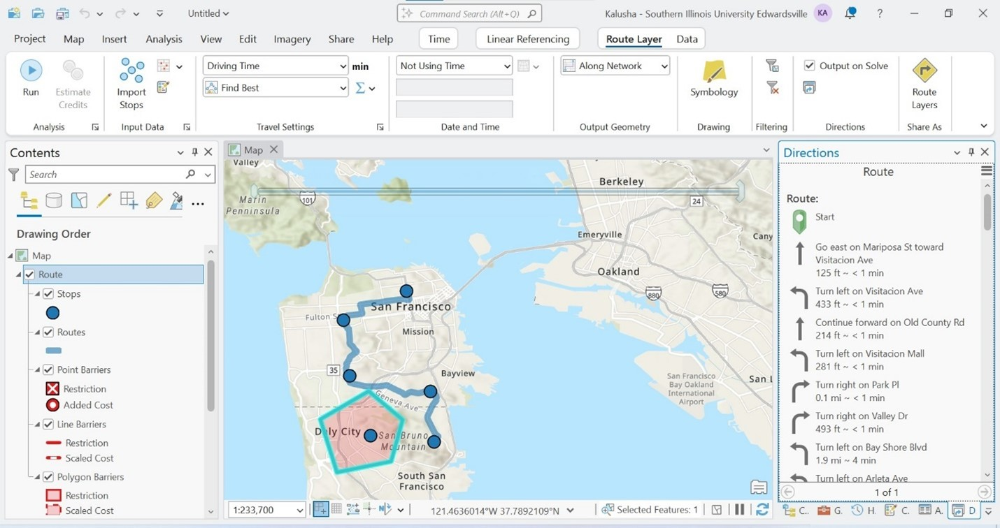
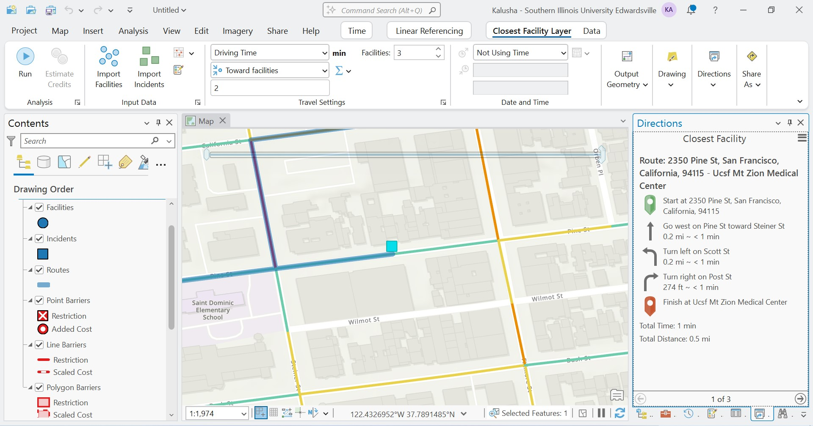
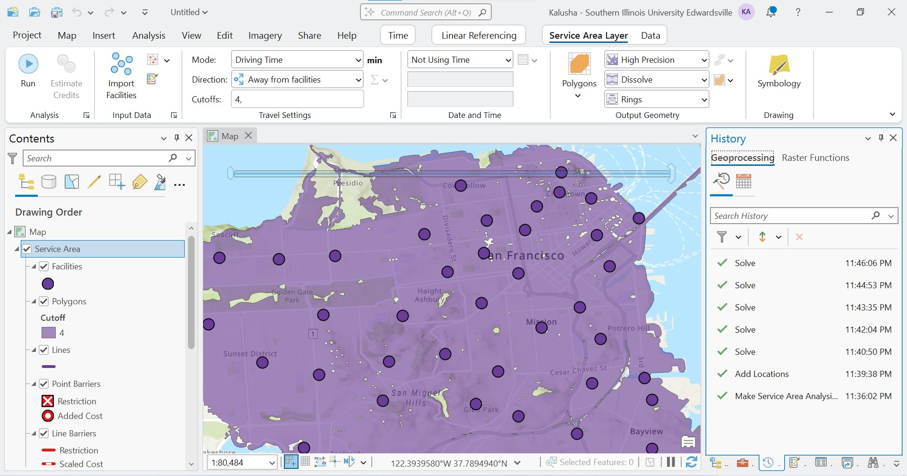
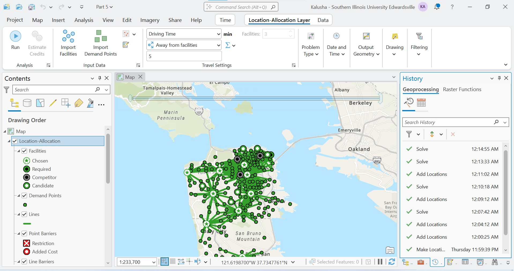
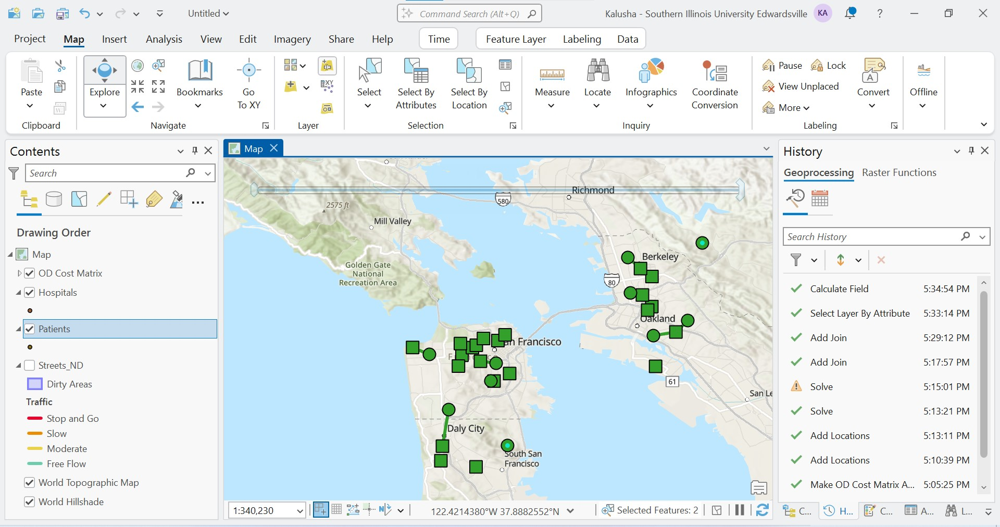
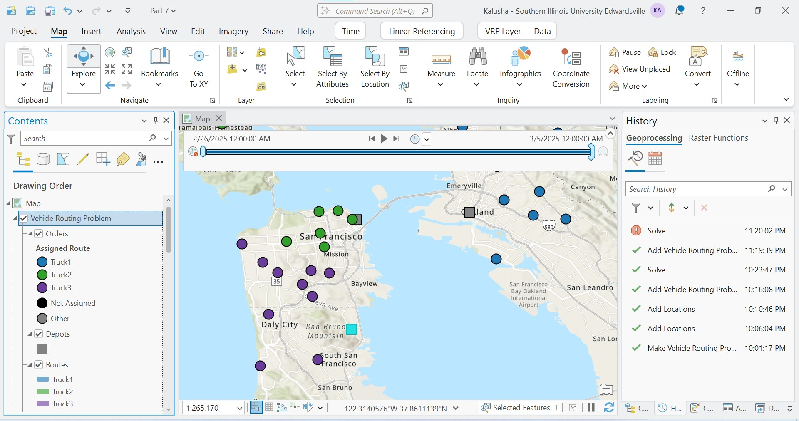

# Network Analysis Using ArcGIS Pro

## Overview
This project demonstrates multiple network analysis techniques using ArcGIS Pro’s Network Analyst extension to solve transportation, accessibility, and logistics problems.

---

## Tools Used
- ArcGIS Pro
- Network Analyst Extension

---

## Methods

### 1. Network Dataset Creation
- Built a network dataset from street and pathway data
- Defined cost attributes (time, distance)
- Applied restrictions (one-way streets, height limits)
- Created travel modes (car, bus, walking)

---

### 2. Route Analysis
- Generated optimal routes between multiple stops
- Added barriers to simulate road closures
- Produced turn-by-turn directions

---

### 3. Closest Facility
- Identified nearest hospitals to an incident
- Generated routes and travel times

---

### 4. Service Area
- Mapped areas reachable within a 4-minute drive
- Used fire stations as facilities

---

### 5. Location-Allocation
- Identified optimal store locations
- Maximized customer attendance and market share

---

### 6. OD Cost Matrix
- Calculated travel times between origins and destinations
- Identified areas with limited accessibility

---

### 7. Vehicle Routing Problem (VRP)
- Optimized delivery routes with constraints
- Included capacity, time windows, and breaks

---

## Skills Demonstrated
- Network Analysis
- Route Optimization
- Accessibility Analysis
- Location Optimization
- Logistics Modeling
- ArcGIS Pro

---

## Author
Kalusha Aguti
